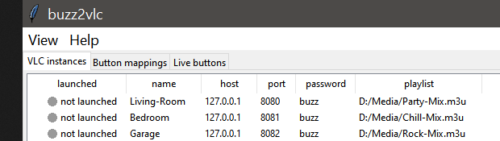
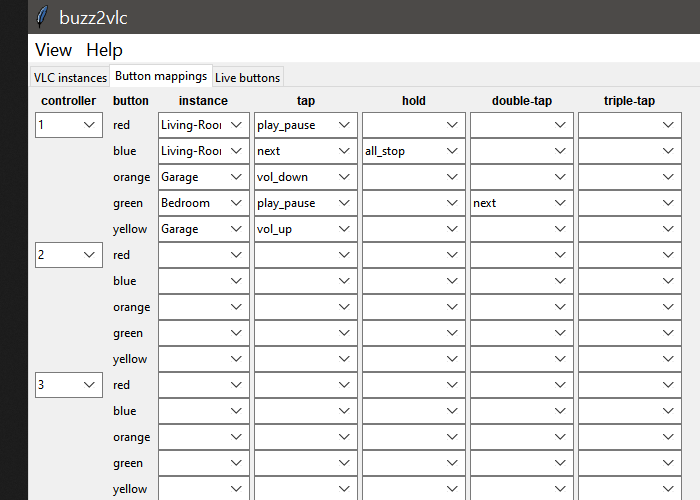
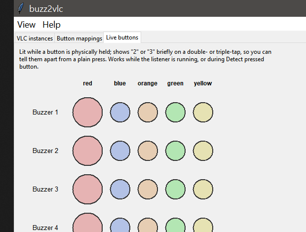

# buzz2vlc

Control multiple VLC instances (each with its own playlist) using a PS2/PS3
Buzz controller. A big red buzzer button can trigger a horn sound effect
(short press) and play/pause (long press); the other buttons are instant
transport controls per player.

> **Provenance note:** this project was originally built and iterated over
> many rounds in a Claude.ai chat, including 16 rounds of testing/debugging
> against real VLC and hardware mocks. This copy was **rebuilt from that
> conversation's full specification and bug-fix history** (via Claude Code)
> rather than copied byte-for-byte, because the share link this project was
> pulled from only preserves the initial file writes, not the many
> in-place edits from those debugging rounds. It incorporates the same
> fixes that conversation found (volume clamp, wireless LED-init, Windows
> HWND truncation, connection keep-alive, config permissions, etc.) but
> has **not** been re-run through that same 16-pass gauntlet, and the two
> things no amount of testing away from the hardware can settle --
> `button_byte` and colour order -- are still unverified for your specific
> unit. Run `python buzz2vlc.py --diagnose` before trusting the defaults.

## Screenshots

The GUI (`buzz2vlc_gui.py`) has three tabs. Data shown below is a demo
config, not a real setup.

**VLC instances** — add/edit/launch each VLC player and its playlist:



**Button mappings** — per-controller, per-button actions for tap, hold,
double-tap, and triple-tap:



**Live buttons** — shows presses in real time, including double/triple-tap
detection, useful for testing a controller without touching VLC:



## Why a Python plugin instead of a VLC Lua extension

VLC's extension system is Lua-only, and Lua extensions have no USB/HID
access at all -- there's no way for one to read the Buzz controller
directly. The architecture here is a small Python companion daemon that
reads the Buzz receiver over HID (via `hidapi`) and drives VLC through its
built-in HTTP interface (`--extraintf http`). That HTTP interface *is*
VLC's Lua endpoint, so this uses the same integration point Lua would,
without needing to write any Lua.

## Requirements

```bash
pip install hidapi requests
```

No VLC driver installs are required: Windows 10/11 handles the Buzz
receiver with its built-in `HidUsb` driver, and Linux uses the kernel's
generic HID subsystem. See **Windows setup** below for the one common
snag.

## Files

Two Python files, plus a double-click launcher:

| File | Purpose |
|---|---|
| `buzz2vlc.py` | Everything headless: HID reading, tap/hold/double-tap timing, VLC HTTP control, config, dispatcher, ducking, hotplug, LED status, cross-platform window focus/raise, the hardware diagnostic, and the CLI. No GUI dependency (no `tkinter` import) -- runs on a headless media PC. |
| `buzz2vlc_gui.py` | tkinter GUI (instances tab, mapping tab, launch, listener control, font size control). Imports `buzz2vlc.py` for everything except the widgets. |
| `Launch_buzz2vlc.bat` | Double-click entry point: installs dependencies on first run, then opens the GUI with no console window. |
| `CONTACT.txt` | GitHub link / developer email / license, shown in Help -> About. Edit directly -- ships with placeholder values. |

The hardware diagnostic and window-focus code used to be separate files
(`buzz2vlc_diagnose.py`, `buzz2vlc_window.py`), and the tap/hold state
machine was its own module (`buzz2vlc_press.py`); they're folded into
`buzz2vlc.py` now that this project has settled rather than being actively
split across many small in-progress files. `buzz2vlc_gui.py` stays
separate on purpose -- it's the one file with a `tkinter` dependency, so
a headless install (`buzz2vlc.py` alone) never needs to pull it in.

## Quick start

Double-click **`Launch_buzz2vlc.bat`** to open the GUI directly (installs
`hidapi`/`requests` on first run if missing, then launches silently via
`pythonw` with no console window). Or from a terminal:

```bash
python buzz2vlc.py --list                 # confirm the receiver is seen
python buzz2vlc.py --diagnose              # settle button_byte / colour order / LEDs for your unit
python buzz2vlc_gui.py                     # add VLC instances, map buttons, launch, start listener
```

Or headless, without the GUI:

```bash
vlc --extraintf http --http-password buzz --http-port 8080 --no-one-instance movies.xspf
vlc --extraintf http --http-password buzz --http-port 8081 --no-one-instance music.xspf
python buzz2vlc.py --learn
python buzz2vlc.py
```

Config lives at `~/.buzz2vlc.json` (override with `BUZZ2VLC_CONFIG`). The
GUI and CLI read/write the same file, so map with one and run the other.

## Multi-instance mapping

Each VLC instance needs its own HTTP port. Mapping values are
`"<instance>/<action>"`, so any button on any buzzer can control any
player:

```json
"mappings": {
  "1:red":    {"tap": "sfx/horn:horn.wav", "hold": "movies/play_pause"},
  "1:yellow": "movies/pause",
  "2:red":    "music/pause"
}
```

Actions: `play`, `pause`, `play_pause`, `stop`, `next`, `prev`,
`seek+10s`, `seek-10s`, `vol_up`, `vol_down`, `mute`, `fullscreen`,
`shuffle`, `loop`, `focus`, `identify`, `horn:<path or folder>`, plus the
global `all_pause` / `all_stop` panic buttons.

**`horn:<path>` is config-file-only** -- it's not one of the GUI's
selectable tap/hold/double/triple actions (the GUI had a sound-file
field for it that was unreachable from those dropdowns and got removed
rather than left as dead UI). Set it by hand-editing the JSON as above;
the GUI still displays and preserves an existing horn binding correctly,
it just can't create or change one.

**Windows note:** VLC's default "allow only one instance" setting would
route a second launch into the first window. `buzz2vlc.py` always launches
with `--no-one-instance`, so this is handled for you when you launch
through the GUI or `launch_instance()` -- only matters if you start VLC
by hand instead.

**Launching loads the playlist without playing it, via `--start-paused`.**
Verified live: status stays `paused` from the very first poll after
launch, never transitioning through `playing` at all -- no audible or
visible blip, and (unlike an earlier approach that let it autoplay and
raced a background thread to catch and stop it) no race condition to get
wrong. The full playlist still expands correctly (a multi-track
`.m3u`/`.xspf` shows every track, not just the first). Trigger playback
with a mapped `play`/`play_pause` action, or from the GUI.

**Why there's no `--meta-title` or `--no-playlist-autostart` flag,
despite both looking like the obvious way to solve the above:** both
were tried and reverted after testing against real VLC.
`--no-playlist-autostart` does stop auto-play, but it also silently
suppresses VLC's expansion of a playlist *file* into its individual
tracks -- expansion only happens as part of opening the first item for
autostart, so every track in a `.m3u`/`.xspf` collapsed into one
unparsed entry. `--start-paused` sidesteps this entirely: the item still
gets opened (so expansion happens), it's just never actually played.
`--meta-title` does label the window, but it's documented VLC behavior
to also replace every playlist item's displayed name with that title --
so a 3-track playlist showed the same `buzz2vlc: <name>` for all three
tracks instead of their real titles. Window identification doesn't need
it anyway: `raise_window()` matches by PID first (always known for
anything buzz2vlc launched), which needs no window-title labeling at all.

## Tap / hold / double-tap / triple-tap

- A button with only a `tap` binding fires immediately on release -- no
  added latency for next/pause.
- A button with a `hold` binding fires that action the moment held time
  crosses the threshold (`hold_ms`, default 600ms) **while still held**,
  not on release, so you get feedback immediately. Release early and the
  tap fires instead.
- A button with a `double_tap` and/or `triple_tap` binding delays
  resolution by `double_tap_ms` (default 300ms) to see whether another
  press lands -- so a single press, a double-tap, and a triple-tap on the
  same button can each do something different. Three rapid taps on a
  button with only a `double_tap` binding (no `triple_tap`) resolve as a
  double-tap rather than being discarded.
- `repeat_ms`, if set, re-fires the hold action every N ms while held --
  useful for ramping volume instead of stepping once.

## Horn ducking

When a horn plays, other players' volume drops to `duck.level_pct`
(default 25%) and restores after `duck.restore_delay_s` (default 2.5s).
Overlapping horns don't compound: the pre-horn volume is captured once
and a second horn during the ducked window just extends the restore
timer rather than saving the ducked level as "original". A paused player
is never ducked (it would come back quiet with nothing having played).

## Hotplug and swapping controllers

Unplugging the receiver doesn't kill the listener -- it reports the
disconnect, retries every `reconnect_interval_s` (default 3s), and
resumes automatically. You can also start `buzz2vlc.py` before plugging
the receiver in; it waits instead of exiting.

Swapping in a different physical Buzz set (e.g. a spare unit when one's
batteries die) needs no reconfiguration: `button_byte`, `button_order`,
instances, and every mapping live in the saved config, never tied to a
particular receiver's identity, so a new receiver picks up the exact
same settings the instant it connects. The GUI's **Reconnect receiver**
button forces an immediate rescan instead of waiting out the poll
interval -- use it right after swapping.

## LED status

Solid = that buzzer's assigned player is playing. Blinking = paused. Off
= stopped. Each buzzer is auto-assigned to whichever instance most of its
buttons point at; horn-only buttons don't make the effects player claim a
buzzer.

## GUI: editing, launch status, and live button feedback

- **Double-click a row** on the VLC instances tab to edit it (same as
  selecting it and clicking Edit).
- The instance editor has a **Browse...** button next to the playlist
  field to pick a file instead of typing a path.
- The **launched** column shows a colored traffic light per instance:
  gray = not launched, amber = launched but not yet reachable (still
  starting, or the HTTP port was already taken -- see Known gaps), green
  = launched and controllable, red = the VLC process exited/crashed. It
  refreshes automatically every 2.5s as well as via Refresh status.
- VLC instances tab columns **auto-size to their content** (a long
  playlist path gets its own width instead of being truncated at a
  fixed guess; `port` stays narrow) and re-fit whenever the font size
  changes. Columns don't stretch to fill extra window width (`ttk`'s
  default column behavior otherwise silently overrides content-based
  sizing the moment you resize the window at all).
- **Help -> Manual** shows this README in a scrollable window; **Help ->
  About** gives a short description plus contact info read from
  `CONTACT.txt` (GitHub link / developer email / license -- edit that
  file directly, it's kept out of source on purpose; **the shipped
  version has placeholder values, replace them**). **Quit**
  (bottom-right of the VLC instances tab) closes the app the same way
  the window's own close button does -- stops the listener cleanly first.
- **Launching tiles windows instead of stacking them, clear of the
  taskbar wherever it's docked, with a 2cm margin.** Each instance gets
  a slot in a grid sized to the number of configured instances (2x2 for
  four, etc.), based on its position in the config -- stable across
  launches regardless of order. The grid is laid out inside the
  desktop's *work area* (`SPI_GETWORKAREA`, Windows) rather than the
  full screen -- verified live on a system with the taskbar docked to
  the **left** edge (not the usual bottom) that the work area correctly
  excludes it; a "subtract N px from the bottom" guess would have failed
  outright here. A further 2cm margin (DPI-aware -- queries the real
  system DPI rather than assuming 96) insets from all four edges of that
  area. Positioning happens in a background thread that polls for the
  new window by PID (creation lags slightly behind the process starting)
  and moves it via `SetWindowPos` (Windows) / `wmctrl -r ... -e`
  (Linux) -- verified live with four real VLC instances landing in four
  distinct, non-overlapping quadrants via `GetWindowRect`. This never
  needs to steal focus, so it isn't affected by the foreground-lock
  issues that complicate window *raising* (see Window focus / identify).
- The **Live buttons** tab shows all 20 buttons (4 buzzers x 5 colors,
  laid out left-to-right the way they actually sit on the controller --
  red, blue, orange, green, yellow -- with the big red button drawn
  larger) and reflects real physical state: a button stays lit for
  exactly as long as it's held down (not a fixed flash), and shows "2"
  or "3" briefly on a double- or triple-tap so you can tell them apart
  from a plain press at a glance -- useful when each fires a different
  action. Works while the listener is running, or during Detect pressed
  button. This detection runs independently of your actual mappings, so
  "2"/"3" show up correctly even for a button that currently has only a
  plain `tap` binding -- the dispatch engine itself skips double/triple
  counting for a button with no `double_tap`/`triple_tap` action bound
  (so a genuinely unmapped tap fires with no added latency), which would
  otherwise make the display look broken for exactly those buttons.
- The **Activity log** (bottom of the window) timestamps every line
  (`[HH:MM:SS]`). A **Verbose controller activity** checkbox (on by
  default) logs every physical button press/release, double/triple-tap,
  and resolved action (e.g. `action: movies/pause`) as they happen --
  turn it off to quiet the log to just launches/errors/saves. **Save
  log...** writes the full current log to a `.log`/`.txt` file;
  **Clear** empties it.
- Adding an instance immediately shows up in every mapping row's
  instance dropdown on the Button mappings tab -- no need to reopen the
  app or rebuild the mapping table.
- **Renaming an instance updates every mapping that referenced it**,
  immediately. A mapping's action is stored as plain text
  (`"<instance>/<verb>"`), not a reference, so a rename that only touched
  `vlc_instances` would otherwise leave every mapped row for that
  instance showing the no-longer-existing old name -- confirmed live to
  no longer be selectable in the dropdown at all, an "old entry" stuck
  in a field that only offers current names. Renaming now rewrites every
  affected mapping's action strings and updates any already-open mapping
  row to match, so it's correct immediately and after a restart.
- **Shutdown ALL** closes every launched instance, WM_CLOSE first (VLC's
  own clean shutdown path) with a hard kill only if that doesn't work
  within a few seconds.
- The Button mappings tab groups rows into 4 quadrants -- one **controller**
  dropdown per quadrant (not per row), spanning its 5 color rows. This is
  what lets a whole set of tap/hold/double/triple/instance settings move
  to a different physical buzzer number in one click (see Hotplug and
  swapping controllers) without touching any of those settings. Since
  there are only 4 physical slots, reassigning one quadrant's controller
  number always swaps it with whichever quadrant currently holds that
  number -- two quadrants can never end up pointing at the same buzzer.

Note: `DISPLAY_ORDER` (the GUI's left-to-right layout) is independent of
`button_order` in the config (the HID *bit* order used to decode raw
reports -- hardware-driven, and still whatever `--diagnose` determined
for your unit). Changing one has no effect on the other.

## GUI font size

The GUI's **View** menu has Increase/Decrease/Reset Font Size (also
`Ctrl` `+` / `Ctrl` `-` / `Ctrl` `0`, or `Ctrl` + mouse wheel). It rescales
the whole interface -- labels, buttons, tabs, the instance/mapping
tables, and the log pane -- not just one widget, which is useful on a
high-DPI display or a TV-connected media PC viewed from a couch. The
setting is session-only (resets to the system default each launch).

## Windows setup

No driver download needed -- plug in and go. Two things that can trip you
up:

1. **"Standard USB Hub" misdetection.** If Device Manager shows a yellow
   warning triangle, right-click the device -> *Update driver* -> *Browse
   my computer* -> *Let me pick from a list* -> **USB Input Device** -> OK.
   Nothing gets downloaded; you're just pointing Windows at a driver
   that's already there.
2. **Wireless pairing.** Switch on all four buzzers, then hold the bind
   button on the dongle until its light flashes solid. The wireless
   dongle also reports no button presses at all until it receives an
   output report -- `buzz2vlc.py` sends one on open regardless of your
   LED settings, so this is handled automatically.

Verify with `python buzz2vlc.py --list`; you want
`wired: vid=054c pid=0002` or `wireless: vid=054c pid=1000`.

## Window focus / identify

`focus` raises a player's window; `identify` raises it and flashes it a
few times for when windows overlap or sit on different monitors. Both
match by PID (always known -- `launch_instance()`'s caller registers it
with the engine), not by window title: an earlier `--meta-title` flag
would have labeled windows for easy human recognition, but it also
renamed every playlist track to match (see Multi-instance mapping), so
it was dropped in favor of PID-only matching. Every buzz2vlc window's
title bar shows the generic "VLC media player" as a result.

- **Linux/X11**: needs `wmctrl` or `xdotool`.
- **Wayland**: no external program can raise another program's window --
  this is a platform restriction, not a bug. Log in with X11/Xorg.
- **Windows**: only the foreground process may steal focus, and a buzzer
  press means buzz2vlc never is one -- so `focus` runs four fallbacks
  (plain call, attach to the foreground thread's input queue, briefly
  zero the foreground-lock timeout, BringWindowToTop) before giving up
  and letting Windows flash the taskbar button instead.

## Security notes

- The config file (which holds VLC HTTP passwords) is written `0600`
  (owner read/write only) on Linux/macOS; not applicable on Windows.
- VLC's HTTP interface is always bound to `127.0.0.1` -- never exposed
  off the machine.
- The password is visible to other local users via the process list
  (VLC's `--http-password` has no environment-variable alternative).
  This only matters on a shared machine; use a throwaway password there.
- A playlist path is passed after a `--` separator so a filename starting
  with `-` can't be parsed by VLC as an option.

## Known gaps

- **`button_byte` / colour order** are configurable but unverified
  defaults -- two credible community sources disagree on colour order
  across hardware revisions. Run `python buzz2vlc.py --diagnose` once per unit.
- **A taken HTTP port doesn't stop VLC from starting** -- it silently
  drops the web interface and keeps playing, leaving a player buzz2vlc
  can only report as "unreachable". `launch_instance()` checks the port
  before launching and raises a clear error instead of hitting this.
- Manually lowering a player's volume while a horn is ducking it: the
  pre-horn level wins when the duck restores. This is a deliberate
  trade-off (fixing it needs volume-change detection), not an oversight.
- **Fixed:** a bare Windows path passed as a playlist (e.g.
  `C:\Media\movies.xspf`) was not reliably recognized by VLC on launch --
  verified live: the instance would start with an empty playlist and no
  error. Playlist/media paths are now resolved to a proper `file://` URI
  before launch (`_playlist_to_target`); an already-URL-shaped value
  (`http://`, `rtsp://`, an existing `file://` URI) is passed through
  unchanged.

## Self-test

```bash
python buzz2vlc.py --selftest
```

Runs a battery of checks (volume clamping, malformed-report handling,
config migration, press-tracker timing) with no hardware or VLC required,
so you know the install is sound before plugging anything in.
