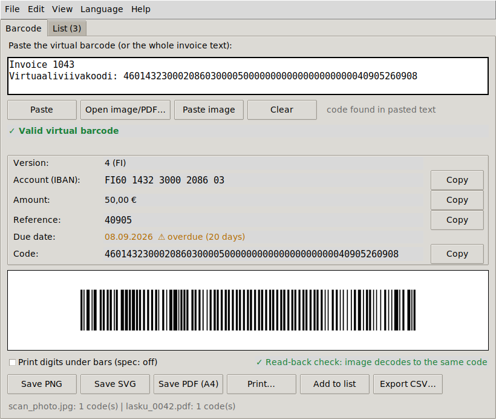
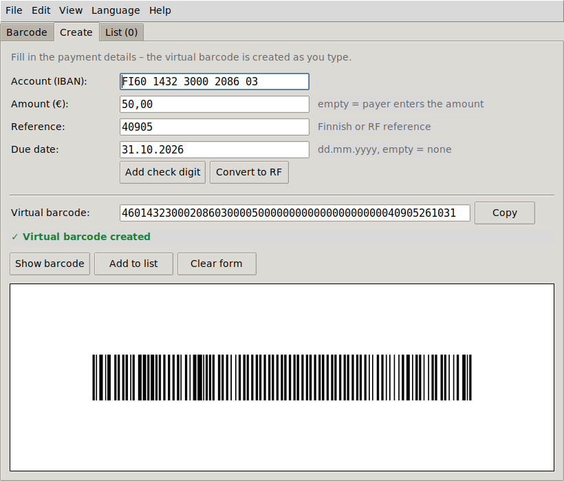
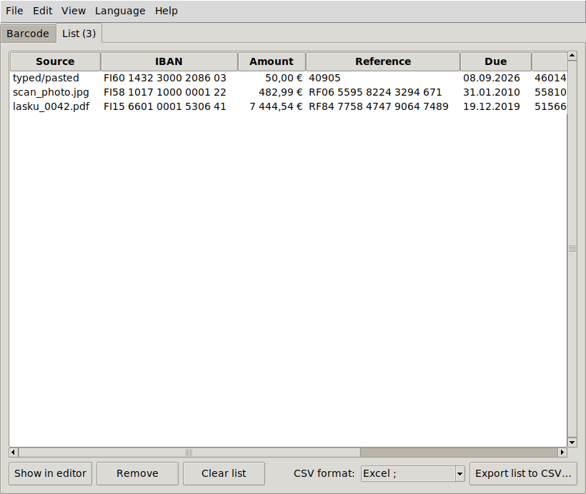
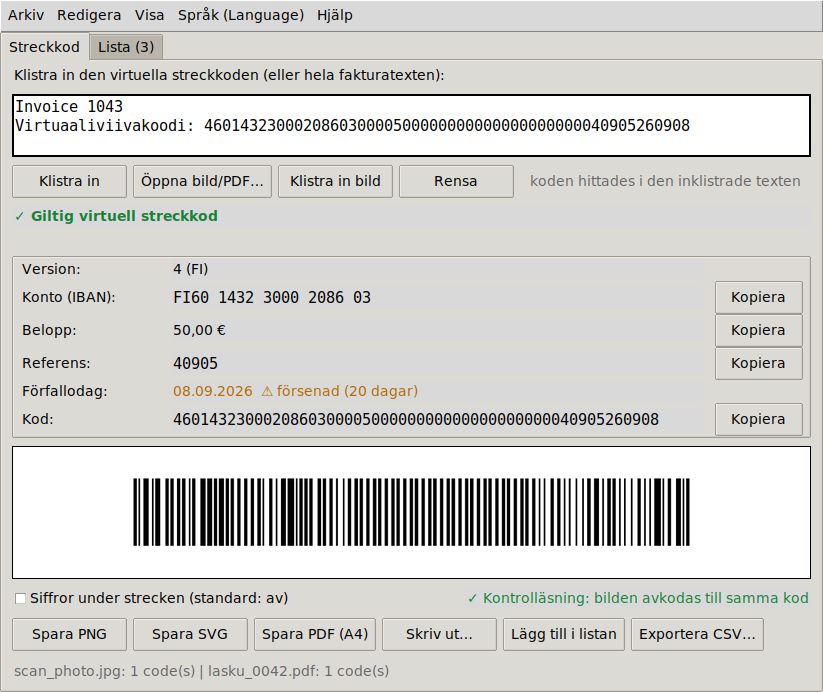
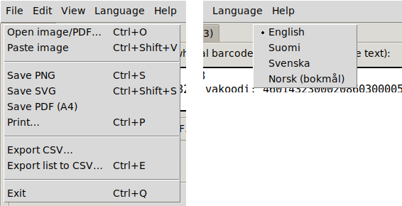

# vcode2bar

Convert a Finnish **virtual barcode** (*virtuaaliviivakoodi*) into a printable bank barcode — and back.
One Python file, GUI and command line, no data leaves your machine.



## Features

- **Create codes from a form** – IBAN, amount, reference, due date → virtual barcode and live barcode preview.
  Helpers add the Finnish check digit to a reference base or convert it to an RF reference.
- **Paste anything** – the bare 54-digit code or a whole invoice / e-mail; the code is found automatically.
- **Full validation** – IBAN (mod 97), reference check digit (Finnish 7-3-1 or RF mod 97), amount, due date, version 4/5.
- **Spec-compliant barcode** – Code 128 set C per *Finanssiala Pankkiviivakoodi-opas v5.3*
  (99.6 mm × 12 mm bars, 20 mm quiet zones, no digits under the bars).
- **Export** – PNG (600 dpi), SVG (vector), print-ready A4 PDF, or print directly.
- **Read barcodes back** from photos, scans, screenshots, clipboard images and invoice PDFs
  (PDF text layer *and* barcode graphic). Rotated, tilted, low-res, noisy and JPEG-compressed images are handled.
- **Read-back check** – every generated image is decoded again to prove it scans to the same code.
- **List + CSV export** – collect codes, export as Excel-Nordic (`;`, decimal comma) or standard CSV.
- **Languages** – English (default), Finnish, Swedish, Norwegian. The choice is remembered.
- **Menus, help and shortcuts** – user guide, keyboard shortcuts, format reference, component check.

| Create from a form | List tab |
|---|---|
|  |  |





## Platforms

One file, one command on every platform: `python vcode2bar.py` (Windows: `py vcode2bar.py`).

| Platform | GUI | Printing | Paste image | Settings file |
|---|---|---|---|---|
| Windows 10/11 | native Tk | default PDF app | native | `%APPDATA%\vcode2bar\settings.json` |
| Linux | X11/Wayland | `xdg-open` | `xclip` / `wl-paste` | `~/.config/vcode2bar/settings.json` |
| WSL2 | via WSLg | Windows PDF app | Windows clipboard (PowerShell) | `~/.config/vcode2bar/settings.json` |

Without a display (SSH, server, WSL without WSLg) the GUI exits with a clear message and every
command-line feature still works. Console output never crashes on non-UTF-8 consoles.
The GitHub Actions workflow in `.github/workflows/selftest.yml` runs the full self-test on
Windows, Ubuntu 22.04 and Ubuntu 24.04 with Python 3.9 and 3.12 on every push.

## Install

**Windows / macOS**
```bash
pip install -r requirements.txt
python vcode2bar.py            # opens the GUI
```

**Ubuntu 24.04** (python-barcode and pypdfium2 are not packaged in Ubuntu, so they come from pip in a venv)
```bash
sudo apt install python3-tk python3-pil python3-pil.imagetk python3-pyzbar libzbar0t64 python3-venv xclip
python3 -m venv --system-site-packages ~/.venvs/vcode2bar
~/.venvs/vcode2bar/bin/pip install python-barcode pypdfium2
~/.venvs/vcode2bar/bin/python vcode2bar.py --deps     # every line should say OK
```
On Ubuntu 22.04 and older the zbar package is called `libzbar0`.

**WSL2 (Ubuntu on Windows)** – install as for Ubuntu above; the GUI runs through WSLg. vcode2bar detects
WSL and uses Windows for the parts WSL can't do well:

- *Print…* opens the PDF in your Windows PDF viewer (`wslview` if installed, otherwise `explorer.exe`).
- *Paste image* reads the **Windows** clipboard through PowerShell interop – screenshots, copied images, and
  invoice files copied in Explorer. WSLg's own clipboard sync is used only as a fallback.
- Save/open dialogs start in your Windows `Downloads` folder (`/mnt/c/Users/<you>/Downloads`).

This needs WSL interop (on by default; see `[interop]` in `/etc/wsl.conf`). Check with `--deps`.

**Or run it natively on Windows** – the tool is plain Python, so this avoids WSLg entirely:
```powershell
py -m pip install -r requirements.txt
py vcode2bar.py
```
The pyzbar wheel for Windows includes the zbar DLLs; if importing it fails, install the Visual C++ 2013
Redistributable (x64).

`python-barcode` and `pillow` are required. `pyzbar` (image reading, read-back check) and `pypdfium2`
(PDF invoices) are optional – the app tells you what is missing (Help → Check components, or `--deps`).
Pasting images from the clipboard on Linux needs `xclip` (X11) or `wl-clipboard` (Wayland).

## Command line

```bash
# convert: virtual barcode -> barcode image(s)
python vcode2bar.py CODE                                   # viivakoodi.png + .svg
python vcode2bar.py CODE -o lasku --format all --verify    # png, svg and A4 pdf; decode check
python vcode2bar.py CODE1 CODE2 -o batch --format png      # batch_1.png, batch_2.png

# decode only (no images)
python vcode2bar.py --decode CODE [CODE ...] [--json]
cat invoice.txt | python vcode2bar.py --decode -           # finds codes in any text from stdin

# create: payment details -> virtual barcode (and optionally the barcode)
python vcode2bar.py --create --iban "FI79 4405 2020 0360 82" --amount 4883,15 \
                   --ref 868516259619897 --due 12.06.2010
python vcode2bar.py --create ... --code-only               # just the 54 digits, for scripts
python vcode2bar.py --create ... -o lasku --format pdf     # print-ready A4 PDF

# references
python vcode2bar.py --ref-fi 4090                          # -> 40905 (adds the check digit)
python vcode2bar.py --ref-rf 40905                         # -> RF1140905

# read barcodes from images / PDFs, export CSV
python vcode2bar.py --read photo.jpg invoice.pdf --csv found.csv [--excel]

python vcode2bar.py --lang fi | --deps | --selftest 10 | --version | --help
```

| Switch | Meaning |
|---|---|
| `--decode` | validate and print fields only (alias `--info-only`) |
| `--create` + `--iban --amount --ref --due` | build a code; amount empty = payer enters it, due optional |
| `-o STEM`, `--format png\|svg\|pdf\|both\|all` | write images; `--text` puts digits under the bars |
| `--json`, `--csv FILE`, `--excel` | machine-readable output / CSV (Excel: `;`, decimal comma) |
| `-` as CODE | read text from stdin and extract every valid code |

Exit codes: 0 ok, 2 invalid input, 3 read-back check failed, 5 nothing found in a file.
CSV/JSON fields: `source, code, version, reference_type, iban, amount_eur, reference, due_date, days_overdue, decoded_at`.

## Virtual barcode format (54 digits)

| Positions | Content |
|---|---|
| 1 | Version: 4 = Finnish reference, 5 = RF reference |
| 2–17 | IBAN without `FI` (16 digits) |
| 18–23 / 24–25 | Euros (6) / cents (2); all zeros = payer enters the amount |
| 26–28 / 29–48 | v4: reserved `000` / reference, zero-padded (20) |
| 26–27 / 28–48 | v5: RF check digits / RF reference body, zero-padded (21) |
| 49–54 | Due date `YYMMDD` (`000000` = not given) |

Specification: [Finanssiala – Pankkiviivakoodi-opas v5.3 (PDF)](https://www.finanssiala.fi/wp-content/uploads/2021/03/Pankkiviivakoodi-opas.pdf)

## Troubleshooting

If a code validates but no barcode appears, the window now shows the exact error under the preview
(and the full details in the terminal). Run `python vcode2bar.py --deps` to check the components.

## Testing

`python vcode2bar.py --selftest [RUNS]` runs four suites (the GUI suite needs a display; on a headless
Linux box use `xvfb-run`):

- **create** – all 18 official invoices rebuilt from their printed fields, random round trips,
  every invalid input mapped to the right field, and every CLI switch.
- **core** – all 18 official Finanssiala test invoices (fields + Code 128 checksums), independent
  third-party vectors, invalid-input rejection, 300 random codes rendered and decoded back.
- **read/csv** – CSV in both formats, formula-injection guard, images under rotation/tilt/noise/down-scaling,
  JPEG, multiple barcodes per image, non-bank barcodes, image-only and text-only PDFs, CLI.
- **gui** – the Create form, error reporting when rendering/preview/zbar fail, every menu in all four languages, shortcuts, help windows, settings persistence, loading files,
  clipboard images, list and CSV export.

Notes found while testing against the spec: the published checksum of v5 test invoice 3 (59) is an
erratum left from the 2019 example change – the spec's own algorithm gives 34, as does python-barcode.

## License

MIT
