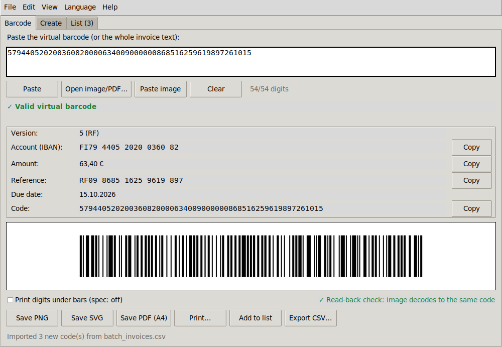
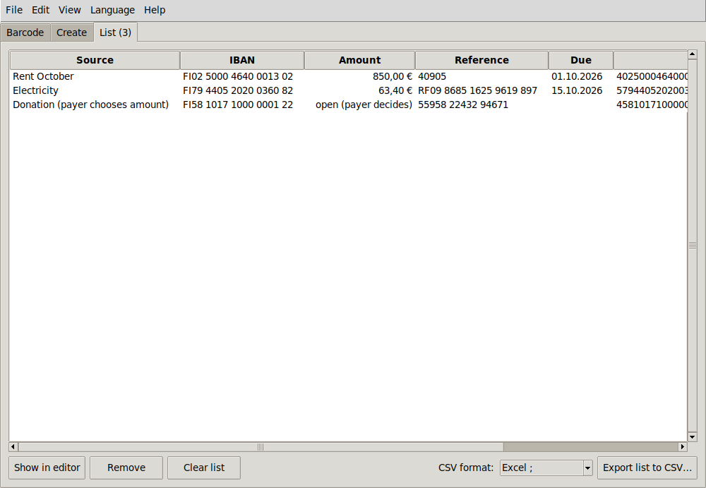
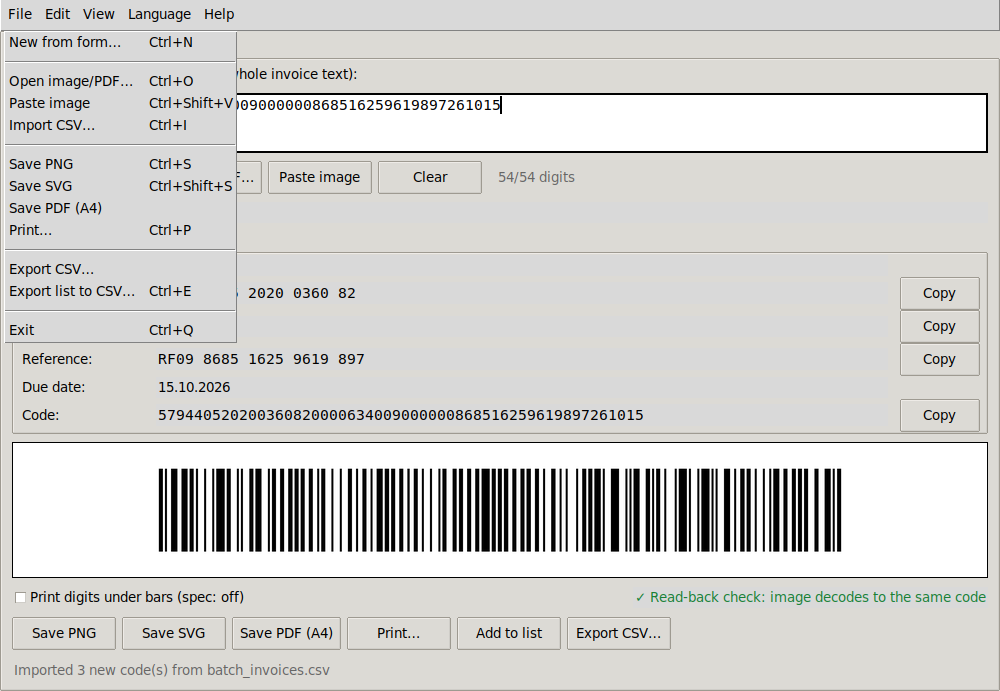

# vcode2bar – user guide (GUI)

Start the window with `python vcode2bar.py` (Windows: `py vcode2bar.py`, or double-click
`launch_vcode2bar.bat`; after `pip install .` also `vcode2bar-gui`). Everything runs locally: no
invoice data is sent anywhere.

The window has three tabs: **Barcode**, **Create** and **List**. The same features are in the menus
(*File, Edit, View, Language, Help*), and every menu item shows its keyboard shortcut.

- [Barcode tab – from a virtual barcode to a printable barcode](#barcode-tab)
- [Create tab – from payment details to a virtual barcode](#create-tab)
- [List tab – collect, import and export](#list-tab)
- [Reading barcodes from photos, scans and PDFs](#reading-barcodes-from-photos-scans-and-pdfs)
- [Importing a CSV of many invoices](#importing-a-csv-of-many-invoices)
- [Keyboard shortcuts](#keyboard-shortcuts)
- [Languages](#languages)
- [Settings](#settings)
- [WSL notes](#wsl-notes)
- [Troubleshooting](#troubleshooting)

---

## Barcode tab



1. **Paste** the 54-digit virtual barcode (*virtuaaliviivakoodi*) into the input box. You can also
   paste a whole invoice text or e-mail: the first valid code in it is found automatically, and the
   counter says *code found in pasted text*. Spaces and dashes inside the code are fine.
   If the clipboard already holds a valid code when the program starts, it is filled in for you.
2. The status line turns green (**✓ Valid virtual barcode**) and the fields appear: version, account
   (IBAN), amount, reference, due date and the code itself. The **Copy** buttons copy the value
   without spaces, ready to paste into a bank app. The amount is copied with a decimal comma.
   - An amber due date means the invoice is **overdue** (number of days shown) or **due today**.
   - Amount *open (payer decides)* means the code has no amount (`000000 00`).
3. The **barcode preview** is rendered with the same code that writes the files. The line under it
   shows the **read-back check**: the image is decoded again with zbar and compared with the code
   (*✓ Read-back check: image decodes to the same code*). If it ever says FAILED, don't use the image.
4. **Save PNG** (600 dpi), **Save SVG** (vector), **Save PDF (A4)** (payment details and the
   full-size barcode on an A4 page), or **Print…**, which opens that PDF in your default PDF viewer
   for printing. File names default to `viivakoodi_<reference>_<due date>`.
5. *Print digits under bars* is off by default because the bank specification says the barcode must
   not have human-readable digits next to it. Turn it on only if you know the recipient wants them.

If a code is invalid, the status line says why (e.g. *IBAN checksum failed*, *Reference check digit
failed*, *Code must be 54 digits, got 53*) and the save buttons stay disabled.

## Create tab


Type the payment details. The virtual barcode and a live barcode preview update as you type.

| Field | Accepts |
|---|---|
| Account (IBAN) | Finnish IBAN, `FI` + 16 digits, spaces allowed. Bank barcodes exist only for Finnish accounts. |
| Amount (€) | `1234,56`, `1 234,56`, `1.234,56`, `12,5 €` … up to 999 999,99. **Empty** = the payer enters the amount. |
| Reference | A Finnish reference (4–20 digits including the check digit) or a numeric RF reference (`RF11 40905`). |
| Due date | `dd.mm.yyyy` (also `d.m.yyyy`, `yyyy-mm-dd`). Empty = no due date. |

- **Add check digit** turns a reference *base* (3–19 digits) into a valid Finnish reference
  (`4090` → `40905`).
- **Convert to RF** turns a Finnish reference into the international RF creditor reference
  (`40905` → `RF11 40905`). A Finnish reference gives a version 4 code, an RF reference a version 5 code.
- Any field with a problem shows the reason next to it in red, and nothing is created until all
  fields are valid.
- **Show barcode** opens the result on the Barcode tab (for saving/printing), **Add to list** puts it
  on the List tab, **Copy** copies the 54 digits, **Clear form** starts over.

## List tab



The list collects codes from any source: *Add to list* on the Barcode or Create tab (`Ctrl+L`),
every code read from files or the clipboard, and CSV imports. The *Source* column says where each
one came from. The same code is never added twice.

- **Double-click** a row (or *Show in editor*) to open it on the Barcode tab.
- **Delete** key or *Remove* removes the selected rows. *Clear list* empties the list.
- **CSV format**: *Excel ;* (semicolon, decimal comma, UTF-8 BOM, codes stored as text so Excel
  doesn't turn them into `4.6E+53`), which opens cleanly in Finnish/Nordic Excel, or *Standard ,*.
  The choice is remembered.
- **Export list to CSV…** (`Ctrl+E`) writes all rows. *File → Export CSV…* writes only the code
  on the Barcode tab. The columns are described in [CLI.md](CLI.md#output-formats).

## Reading barcodes from photos, scans and PDFs

- *File → Open image/PDF…* (`Ctrl+O`): select one or more photos, scans, screenshots (PNG, JPG, BMP,
  GIF, TIFF, WebP) or invoice **PDFs**. PDFs are checked twice: the text layer (a printed virtual
  barcode) and the rendered pages (the barcode graphic).
- *File → Paste image* (`Ctrl+Shift+V`): paste a screenshot or a copied image. Files copied in
  Explorer/Finder work too.
- Rotated, tilted (up to ±30°), small, noisy, speckled and JPEG-compressed images are handled.
  Other barcodes on the page (e.g. an invoice number in Code 128) are reported as *ignored*.
- Every code found goes to the list. The first one opens on the Barcode tab, and the status line
  says which file it came from. A file with no barcode gives a warning.

Reading needs the optional `pyzbar` package (and `pypdfium2` for PDFs). *Help → Check components*
shows what is installed.

## Importing a CSV of many invoices

*File → Import CSV…* (`Ctrl+I`) reads a spreadsheet with one payment per row and adds each valid row
to the list. From there you can export it, or open any row on the Barcode tab to save or print it.



```csv
name,iban,amount,reference,due
Rent October,FI02 5000 4640 0013 02,"850,00",40905,01.10.2026
Electricity,FI79 4405 2020 0360 82,63.40,RF09 8685 1625 9619 897,2026-10-15
Donation (payer chooses amount),FI58 1017 1000 0001 22,,559582243294671,
```

- Column names can be English, Finnish, Swedish or Norwegian (`tili`, `summa`, `viite`, `eräpäivä`…),
  and a `name`/`source` column becomes the list's *Source*.
- `,` `;` or tab separators and Excel's encodings are detected automatically.
- A CSV exported from the List tab can be imported again as it is.
- Rows with mistakes are **skipped and listed** in one message with their line numbers, e.g.
  *line 5 (iban): IBAN checksum failed*. Fix them in the spreadsheet and import again: rows already
  on the list are not added twice.

The full format is in [CLI.md → Batch CSV format](CLI.md#batch-csv-format). Try it with
[`examples/batch_invoices.csv`](examples/batch_invoices.csv), which has one deliberately broken row.

## Keyboard shortcuts

On macOS use `Cmd` instead of `Ctrl`. The shortcuts also work while typing in the input box.

| Keys | Action |
|---|---|
| `Ctrl+N` | New from form (Create tab) |
| `Ctrl+O` | Open image/PDF |
| `Ctrl+Shift+V` | Paste image |
| `Ctrl+I` | Import CSV |
| `Ctrl+S` / `Ctrl+Shift+S` | Save PNG / Save SVG |
| `Ctrl+P` | Print |
| `Ctrl+L` | Add to list |
| `Ctrl+E` | Export list to CSV |
| `Ctrl+1` / `2` / `3` | Barcode / Create / List tab |
| `Esc` | Clear the input |
| `F1` | User guide |
| `Ctrl+Q` | Exit |

## Languages

*Language* menu: **English** (default), **Suomi**, **Svenska**, **Norsk (bokmål)**. The whole window,
the help texts and the PDF page change immediately. The choice is remembered, and the command line
uses it too unless `--lang` is given.

## Settings

A small JSON file stores the language, the CSV format and the last folder used:

| Platform | Location |
|---|---|
| Windows | `%APPDATA%\vcode2bar\settings.json` |
| macOS | `~/Library/Application Support/vcode2bar/settings.json` |
| Linux / WSL | `$XDG_CONFIG_HOME/vcode2bar/settings.json` (default `~/.config/vcode2bar/settings.json`) |

A 1.0-era `~/.vcode2bar.json` is still read if the new file doesn't exist yet. A damaged settings
file is ignored (defaults are used).

## WSL notes

Under WSL2 the GUI runs through WSLg, and vcode2bar uses Windows for the things WSL can't do well:

- **Print…** opens the PDF in your Windows PDF viewer (`wslview` if installed, otherwise `explorer.exe`).
- **Paste image** reads the **Windows** clipboard through PowerShell: screenshots, copied images, and
  invoice files copied in Explorer.
- Open/save dialogs start in your Windows **Downloads** folder.

This needs WSL interop, which is on by default (`[interop]` in `/etc/wsl.conf`).
*Help → Check components* shows whether it works.

## Troubleshooting

| Symptom | Fix |
|---|---|
| *Read-back check unavailable* | `pip install pyzbar` (Linux: plus `libzbar0t64`/`libzbar0`; macOS: `brew install zbar`). |
| *Could not render the barcode: …* under the preview | The exact error is shown there and in full in the terminal. Run `python vcode2bar.py --deps`. |
| Opening PDFs says *PDF support needs: pip install pypdfium2* | `pip install pypdfium2`. |
| *Paste image* on Linux says xclip is missing | `sudo apt install xclip` (X11) or `wl-clipboard` (Wayland). |
| The window doesn't open (SSH, server, WSL without WSLg) | The program says so and exits with code 4. Use the [command line](CLI.md). |
| PDF page shows `a`/`o` instead of `ä`/`ö` | No suitable system font was found, so the page falls back to ASCII. Install DejaVu or Liberation fonts. |
| Windows: `pyzbar` import fails | Install the Visual C++ 2013 Redistributable (x64). |
