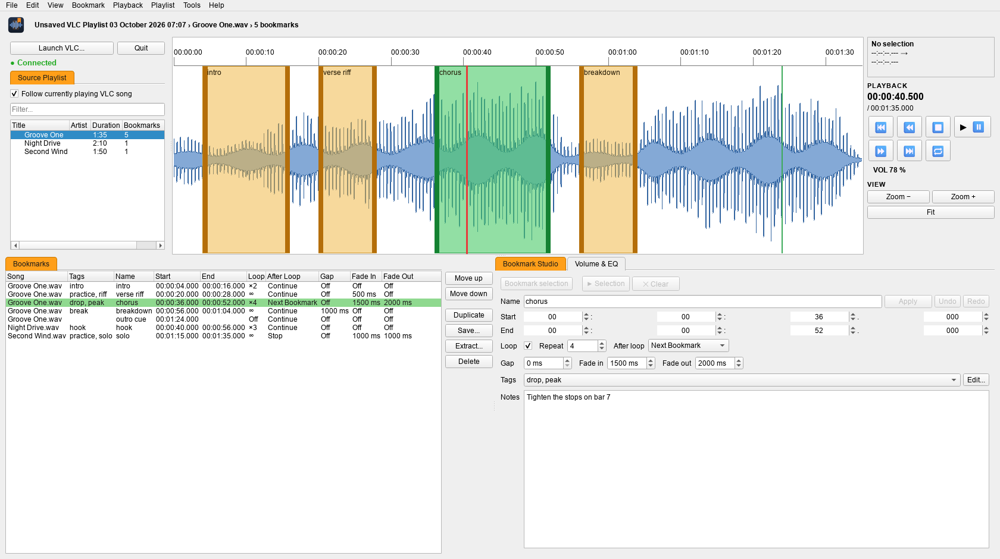
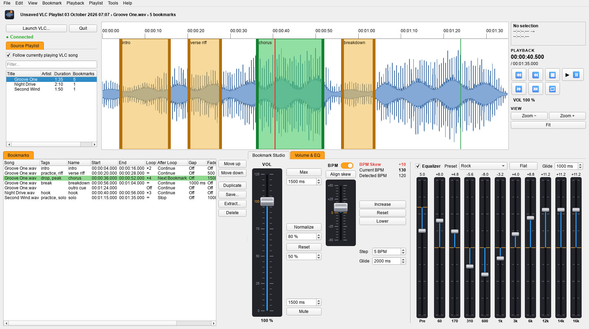
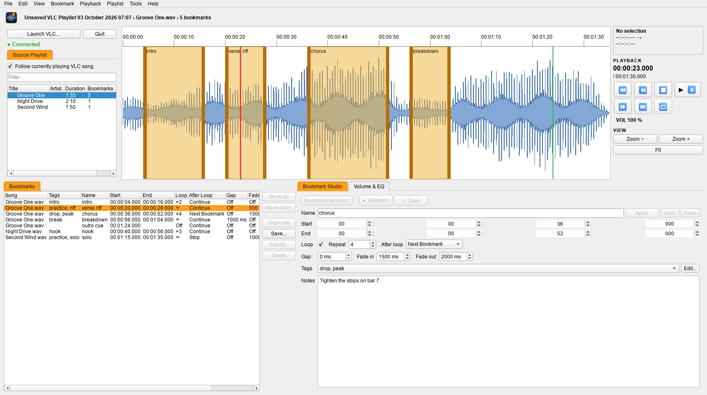
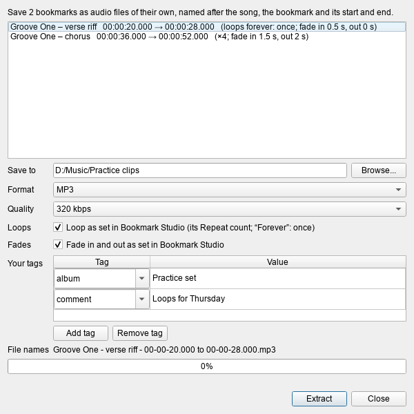

# VLC Bookmark Studio


A playlist-aware visual bookmarking, segment-selection, navigation and
looping system for VLC Media Player. See [PROJECT_SPEC.md](PROJECT_SPEC.md)
for the full design and engineering specification (198 sections), and
[CHANGELOG.md](CHANGELOG.md) for what changed in each version.

Runs on **Windows**, **Linux**, and **WSL (Ubuntu on Windows)**.

Owned by Elie Koivunen; developed by Elie Koivunen and Claude (Anthropic).
**Proprietary pre-release software** -- see [License](#license).

## Screenshots

**A bookmark playing** -- green in the playlist, on the waveform and in the bookmark
list -- with its settings in the Bookmark Studio tab: loop 4×, fades, then on to the
next bookmark.



**Volume & EQ:** the volume fader with Max / Normalize / Reset / Mute, the **BPM**
panel (switched on, playing 10 BPM above the song's detected 120) and VLC's equalizer.



**Playing through a bookmark:** the song plays from the playlist; the bookmark the red
line is crossing shows orange in the list.



**Extract:** bookmarks as audio files of their own -- with their loops and fades, the
song's tags and your own.



<sub>Made-up demo songs, drawn in Qt's Fusion style; on Windows and Linux the app takes the system's own look.</sub>

## Status

Version 0.9.0. The core is implemented and tested: domain model, SQLite
persistence + migrations, media fingerprint/resolution, playlist
recognition across sessions (similarity scoring over stored playlist
order), the FFmpeg waveform pipeline (streamed, shown while it decodes), four
playback adapters (Mock / VLC's built-in HTTP / the custom Lua bridge / the
in-app libVLC player), the software loop controller (gaps, fades, completion
actions, stopping when playback is changed in VLC's own window), undo/redo,
project export/import (format v2, merging), folder sync between machines, and a
PySide6 UI wired end-to-end through a live polling `Application`. All playback
commands run on one ordered queue off the UI thread.

Tests: 580+ unit/integration tests (offscreen Qt, mock VLC) plus opt-in live
tests against a real VLC and libVLC (`tests/vlc/`). Verified on Windows 11
(Python 3.12; VLC 3.0.23 32-bit over HTTP and 64-bit in-app) and WSL Ubuntu
24.04 (Python 3.10–3.13; Ubuntu's VLC 3.0.20, and the Windows VLC through
interop). `ruff` and `mypy --strict` pass on the whole package.

**Not built yet** (see PROJECT_SPEC.md #175-176): Segment Queue, Loop
Trainer, Audacity label import/export, beat markers on the waveform, video
thumbnails, lane assignment in the UI. (Clip export is **Extract...**; a song's
tempo is detected for the BPM panel.)

## Packaged builds (no Python needed)

Each release on GitHub (tag `vlc-bookmark-studio-v<version>`) has:

- **Windows:** `vlc-bookmark-studio-<version>-windows-x64.zip`. Unzip anywhere and
  run `VLCBookmarkStudio.exe`. It contains its own 64-bit VLC (in-app player *and* a
  VLC window) and ffmpeg, so nothing else has to be installed.
  `VLCBookmarkStudio-portable.cmd` keeps the database, settings and logs in a `data`
  folder next to it (e.g. on a USB stick); `VLCBookmarkStudio-cli.exe` is the same
  program with a console, for `--help` and `--self-test`.
- **Linux:** `vlc-bookmark-studio-<version>-x86_64.AppImage` (one file: `chmod +x`,
  run) or the `.tar.gz` folder. They use the system's VLC and ffmpeg
  (`sudo apt install vlc ffmpeg`).

`vlc-bookmark-studio --self-test` (Windows: `VLCBookmarkStudio-cli.exe --self-test`)
checks Qt, the database, sync, ffmpeg, VLC and libVLC and prints what it found.

Up to 0.3.1 the project was called **bm4vlc**; those releases and tags
(`bm4vlc-v<version>`) keep that name. Your data and settings carry over, and the
old `BM4VLC_*` environment variables still work.

## Setup (from source)

You need Python 3.10+, VLC 3.x and (for waveforms) ffmpeg. The app finds VLC
and ffmpeg in their usual places; a path can also be saved in the settings
(`vlc/path`, `ffmpeg/path`) or given on the command line (`--vlc`, `--ffmpeg`).

### Windows

1. Install [VLC](https://www.videolan.org/), [Python](https://www.python.org/)
   (3.10 or newer) and ffmpeg (e.g. `winget install Gyan.FFmpeg`, or unpack it
   to `C:\Program Files\ffmpeg`).
2. In the `vlc-bookmark-studio` folder:

   ```bat
   py -3 -m venv .venv
   .venv\Scripts\pip install -e .
   ```

3. Double-click `launch_vlc_bookmark_studio.bat`.

The in-app player needs a **64-bit** VLC (Python is 64-bit, and a 64-bit
process can't load the 32-bit `libvlc.dll` from `C:\Program Files (x86)`). The
64-bit VLC installs next to a 32-bit one; or point `--libvlc-dir` at an unpacked
`vlc-3.x.y-win64.zip`. With only a 32-bit VLC, the app says so and keeps using a
separate VLC window.

PySide6 installs deep folder trees. If pip fails with *"The filename or
extension is too long"* (Windows' 260-character path limit), put the venv on
a short path instead (`py -3 -m venv C:\v` then `C:\v\Scripts\pip install -e .`;
`launch_vlc_bookmark_studio.bat` also looks there) or enable Windows long paths.

### Linux (Ubuntu/Debian)

```bash
sudo apt install vlc ffmpeg python3-venv libegl1 libxkbcommon0 libxcb-cursor0
python3 -m venv .venv
.venv/bin/pip install -e .
./launch_vlc_bookmark_studio.sh
```

### WSL (Ubuntu on Windows 11)

The app runs as a Linux program inside WSL and shows its window through WSLg.

- **Simplest:** install VLC inside WSL (`sudo apt install vlc ffmpeg`) and
  follow the Linux steps. Audio plays through WSLg; paths and networking are
  native.
- **Using the Windows VLC** (no VLC installed in WSL): the app finds
  `C:\Program Files\VideoLAN\VLC\vlc.exe` automatically, translates file paths
  both ways (`/mnt/c/...` <-> `C:\...`, WSL files via `\\wsl.localhost\...`),
  and, under WSL's default NAT networking, has VLC listen on the WSL virtual
  switch address (reachable from WSL and Windows only). Windows Firewall must
  allow VLC (VLC's installer normally adds that rule; otherwise Windows asks the
  first time). With `networkingMode=mirrored` in `.wslconfig`, plain
  127.0.0.1 is used.

Data lives in `%LOCALAPPDATA%\VLCBookmarkStudio` on Windows and
`~/.local/share/VLCBookmarkStudio` on Linux/WSL (database, waveform cache,
logs), or wherever `--data-dir` says. A WSL session and a Windows session have
separate databases; keep them in step with a sync folder (below).

## Playing: a VLC window or inside the app

**Launch VLC / Open Media...** (Ctrl+O) offers:

- **Play inside this app**: libVLC plays in the app's own process. No VLC
  window, no network port or password, millisecond-exact times and lengths,
  a smoother playhead. Needs libVLC (see Windows above; Linux: `apt install vlc`).
- **Launch a new VLC window**: a VLC driven over its HTTP interface, as before.
  The HTTP password is kept in a private VLC config file (owner-only), not on
  VLC's command line where other local processes could read it.
- **Attach** to a VLC this app started earlier.

If you pause, stop or change the song in VLC's own window while a bookmark is
looping, the loop stops instead of resuming playback.

### The window

- **Top left:** Launch VLC... and Quit, the connection, and the **Source Playlist** tab
  -- *Follow currently playing VLC song*, the filter and the player's playlist. Its
  column titles have the bookmark list's right-click menu (which columns show, in which
  order); the layout is kept.
- **The waveform** has the whole height of the top half.
- **Beside it, top to bottom:** the selection -- start, end and length -- while you drag
  one out ([ and ] set its start and end at the playhead); **Playback**: the position
  and the song's length, the playback buttons (previous bookmark, previous track, stop,
  play/pause, next track, next bookmark, and 🔁 to loop the bookmark selected in the
  list) and the volume (click it for the Volume & EQ tab); then **View** (Zoom −,
  Zoom +, Fit). Previous / next bookmark play the row above / below in the bookmark
  list (across songs), counting from the bookmark playing -- else the selected row --
  and select it, so the Bookmark Studio tab shows it. Play plays the song on screen --
  one picked in the playlist (a single click shows it) is switched to first. Seeking by
  5 seconds is on the Left/Right arrow keys (Playback menu).
- **Below, left:** the **Bookmarks** tab -- every bookmark of the playlist, with its
  Loop and After loop settings among the columns. Drag a column header to put the
  columns in another order, or right-click one: tick the columns to show, move the one
  clicked left or right, **Arrange Columns...** for both at once, or **Restore Default
  Columns**. The order, the widths and which show are kept. Double-click a row to play
  the bookmark. A click on a Loop, After Loop, Gap or Fade value opens its choices,
  each shown in full however narrow the column.
- **Between the two:** Move up, Move down, Duplicate, Save..., Extract... and Delete
  for the selected bookmarks. **Duplicate** (Ctrl+D) copies them -- the same settings,
  each with a new name no other bookmark has -- to the top of the list (one Undo takes
  them all back).
- **Below, right, two tabs:** **Bookmark Studio** -- at the top **Bookmark selection**,
  and **▶ Selection** (loop it) and **✕ Clear** for the selection; then the
  selected bookmark's settings (name, start, end; Loop, Repeat and After loop on one row;
  Gap, Fade in and Fade out on the next; tags; notes); **Volume & EQ** the player's
  volume and equalizer. The selected tab is orange. The open tab, the window size and
  the panel sizes come back on the next start.

**Bookmark Studio:** a change to a bookmark is saved the moment you make it; its row
in the list and the Name field flash orange to show it was saved. Beside the name,
**Undo** and **Redo** step back and forth through your bookmark changes (as Ctrl+Z /
Ctrl+Y do). To make a new bookmark, select a range on the waveform: the tab becomes the
new bookmark's form -- a random name and the usual settings (loop forever, no gap, no
fades), Start and End following the selection (typing them moves the selection). Set it
up as you like and press **Apply** (or Enter in the name, or Bookmark selection /
Ctrl+B); it goes to the top of the bookmark list. (A point bookmark at the playhead:
Bookmark menu, Ctrl+Shift+B.) Apply is greyed out while an existing bookmark is shown --
there, every change is already saved. Changes to the bookmark that is looping right now apply to the loop at
once (e.g. Repeat 1 + After loop: Stop ends it after the current pass). After loop
**Next Bookmark** / **Previous Bookmark** plays the bookmark below / above it in the
bookmark list, in whichever song that one is, with its own settings, and selects it, so
this tab shows its settings (unless a new bookmark is being set up here); past the end
of the list, playback goes on.

**Playing a bookmark** shows it in green in all three places -- its song in the
playlist, its area on the waveform, its row in the bookmark list -- and in yellow once it
has played (its loop completed or was stopped; without a loop, once playback passes its
end, stops or moves on). The yellow stays until the next bookmark plays, or until a
song is played from the playlist -- a double-click, a song picked and ▶, or next /
previous track (a plain ▶ that resumes the same song keeps it). While a song plays
that way -- from the playlist, not a bookmark -- each bookmark whose range the red line
is crossing shows **orange** in the bookmark list, only while it is (scrolled into view;
the selection stays). A selection
playing with **▶ Selection** is green the same way (its song and the selection); press
Bookmark selection while it plays and it carries on as the new bookmark, with the
settings set up in the tab. A bookmark saved while the song plays through it (the main
Play) is green at once too, and loops from there: the pass playing counts as its first,
then its Repeat count, fades and After loop as set -- the same for a selection that was
looping (its count starts at the save).

**Fades of a looping bookmark:** its fade in at its very first start, its fade out before
the end of its last pass -- not on every pass (a "Forever" loop never reaches a last
pass, so it doesn't fade out; switching Loop off, or a Repeat count reached, makes the
pass playing the last).

In the tab's number fields (Repeat, Gap, Fade in, Fade out) a click selects what is
there, so typing replaces "Off" or "Forever" without deleting it first.

**Extract...** (beside the list, or Bookmark menu, Ctrl+E) saves the selected bookmarks
as audio files of their own, to a folder you choose, named after the song's file, the
bookmark and its range -- e.g. `Groove One - drop - 00-00-12.000 to 00-00-21.500.mp3`.
Formats: MP3, Ogg Vorbis, Opus, FLAC and WAV, each with a choice of quality. As each
bookmark is set up in Bookmark Studio (both on to begin with; the list says what each
file gets): **loops** -- its Repeat count, its gap as silence in between, `x3` in the
file name ("Forever" has no count: once) -- and **fades**, its fade in at the very start
and its fade out at the very end of the whole file, however often it repeats. Each file
keeps the song's tags (artist, album, genre...; its cover in MP3 and FLAC), its title
names the bookmark, and it says it was made with VLC Bookmark Studio (the "encoded by"
tag and the comment). **Your tags** adds tags of your own to every file (artist, genre,
comment, or any name), over the song's; they are remembered. A file name some file
system couldn't store -- symbols such as emoji, characters Windows forbids, a reserved
or overlong name -- is replaced by one that starts with the bookmark's own name (its
random, unique string) and keeps what can be kept of the song's, e.g.
`k3x9qa - Groove One - 00-00-12.000 to 00-00-21.500.mp3`. FFmpeg cuts them in the
background; nothing is ever overwritten (a second copy gets "(2)"). Point bookmarks
have no range and are skipped. Only formats the FFmpeg in use can write are offered.

A tab that doesn't fit makes room for itself when opened -- from the bookmark list and
the waveform, then by enlarging the window -- so the equalizer is never cut off. Likewise,
when the window opens with its bookmarks and when you show a column, the window widens
for every column of the bookmark list shown, and the list gets all of the new room (the
tab keeps the width you gave it). The window only ever grows, and never past the
screen; one you narrow afterwards stays so. The divider between the waveform and the
lists below can be dragged.

**Names:** a new bookmark is named with 6 random characters, e.g. `k3x9qa` (its times
are in the Start and End columns). Bookmarks named before 0.7.0 keep their names.

**Tags:** pick a bookmark's tags from a ready-made list (intro, build-up, drop, peak,
breakdown, outro, game start, game end), several at once: open the Tags drop list in the
Bookmark tab and tick them; the choice is saved when the list closes (undoable).
**Edit...** opens the tag list window: add, rename, remove and reorder tags, with the
number of bookmarks using each. Renaming a tag renames it on every bookmark, of every
song and playlist (into an existing tag, the two merge); removing it takes it off them --
the window asks first. The app remembers renames and removals, so an old name can't come
back: undoing an older edit, a sync file from a machine that hasn't heard of the change
yet, or an old project file all get the current name (or lose a removed tag). The tag
list and its changes travel with folder sync and project files. The Tags column shows
each bookmark's tags.

**Volume:** the VOL fader works like a DJ mixer's channel fader (0–125 %, the amber
mark is 100 %): drag it, click where it should go, scroll, or use the arrow keys (Page
Up/Down: 10 %); a double-click returns to 100 %. It follows the player's volume,
including a bookmark's fades as they lower and raise it. Your level stays as you set it,
across songs and bookmarks -- only a bookmark's fades (and you) move it. Playing a song
or a bookmark with the volume at 0 (a VLC this app launches starts muted) starts it at
the Reset level.

Beside the fader: **Max** raises the volume to 125 % (the fader's top) and **Mute**
lowers it to silence, each over the time in its field (milliseconds, like a bookmark's
fades; 0 = at once), while something plays -- a bookmark or a song; with nothing playing
they act at once.
**Normalize** and **Reset** bring the volume to their own level -- 80 % and 50 % to
begin with, set in the field under each -- gliding the way the volume comes: at Max's
speed coming down, at Mute's speed going up (at once when nothing plays). Moving the
fader yourself stops a running Max, Normalize, Reset or Mute. The times and levels are
remembered.

**BPM:** the BPM panel between the volume buttons and the equalizer changes how fast
the player plays, in BPM; VLC keeps the pitch. The switch beside its title turns it on
and off: off (as it starts the first time), the song plays at its own tempo and the
panel is greyed out, so nothing in it changes playback by accident; on again, the tempo
you had set plays. Beside its fader:

- **BPM Skew** -- how far what plays is from the detected BPM, e.g. +10; red whenever
  it isn't 0.
- **Current BPM** -- what plays now.
- **Detected BPM** -- the song's own tempo, estimated from its waveform. If it is off
  (half or double, say), double-click it and type the right one.
- **The fader** plays up to 50 BPM faster or slower than its middle, in steps of 5 (a
  double-click returns to the middle). Its middle is the detected BPM, unless aligned.
- **Align skew** (above the fader) makes what plays now the fader's middle, without a
  change you can hear -- the fader then has its full 50 either way from there. While
  the middle isn't the detected BPM, the button and the fader's 0 mark are red.
- **Increase / Reset / Lower** (stacked, Reset level with the fader's 0): a **Step**
  faster, back to the detected BPM (the skew cancelled), a Step slower -- each gliding
  there over the **Glide** time (ms) while something plays, in small steps VLC plays
  straight through with no gap, and at once otherwise. Moving the fader takes over from
  a glide.

A bookmark moved on to -- After loop Next / Previous Bookmark, or ⏮ / ⏭ -- plays at its
song's detected BPM: BPM Skew back to 0. Another song keeps the change you set, from its
own detected BPM. The switch, Step and Glide are remembered; the tempo itself is only
for playing: not saved, not part of any bookmark; on quitting, the player goes back to
its normal speed.

**Equalizer:** VLC's 10-band equalizer with a preamp and VLC's 18 presets (Flat, Rock,
Club, Dance, ...), ±20 dB per band. Tick *Equalizer* to switch it on; while it is off
the faders are greyed out. Pick a preset or drag the faders (a double-click returns a
fader to neutral: 0 dB for a band, +12 dB for the preamp, which is VLC's neutral
level). A chosen preset (or Flat) glides there over the **Glide** time (ms; remembered)
while something plays, like Max and Mute -- at once when nothing does; grabbing a fader
during a glide takes over. The settings belong to the player, not to a bookmark: they are remembered and
applied to whichever player you use -- the in-app player or a VLC window (through its
HTTP interface; they stay across song changes). The band frequencies follow the player:
60 Hz ... 16 kHz in a VLC window, 31 Hz ... 16 kHz in the in-app player. A switched-off
equalizer leaves a VLC window's own equalizer setting alone.

**Quit** (the button next to Launch VLC…, File > Quit or Ctrl+Q) saves whatever is
still being typed in the Inspector, the window layout and a final sync file, closes the
VLC this app launched (one you attached to keeps running), and exits. Bookmarks
themselves are saved the moment you change them. Closing the window does the same.

## Command line

```text
vlc-bookmark-studio [MEDIA ... | --playlist FILE.m3u] [options]

  --adapter {auto,http,libvlc}  VLC window over HTTP, or the in-app player
                                (auto: the last choice)
  --attach [HOST:]PORT          attach to a running VLC's HTTP interface
  --port PORT                   first HTTP port to try for a launched VLC
  --vlc PATH | --ffmpeg PATH    use these executables (this run only)
  --libvlc-dir DIR              VLC folder whose libVLC the in-app player uses
  --data-dir DIR                database, waveforms, logs and settings in DIR
  --sync-dir DIR                sync bookmarks through DIR (remembered); --no-sync
  --no-dialog                   don't show the open-media dialog at startup
  --log-level LEVEL             DEBUG, INFO, WARNING, ERROR
  --self-test [--require vlc,libvlc,ffmpeg] [--self-test-report FILE]
  --version
```

## Sync between Windows, WSL and other PCs

Start each installation once with the same folder, e.g. from Windows
`--sync-dir C:\Users\me\Bookmarks` and from WSL
`--sync-dir /mnt/c/Users/me/Bookmarks` (a Dropbox/OneDrive/Syncthing folder or a
network share works too). The folder is remembered.

Each installation writes its whole database to its own file
(`vlc-bookmark-studio-sync-<machine>.vlcbmk`; files named `bm4vlc-sync-...` by
0.3.x are read too) and merges the others' at startup, every
minute, on **File > Sync Now** and on exit. For each bookmark the most recent
change wins, and deletions reach the other side. A song is recognised by its
content, so `C:\Music\a.mp3` and `/mnt/c/Music/a.mp3` are the same song, and a
playlist by its song order. Lanes and playlist orders are only added, never
overwritten, by another machine.

## Tests

```bash
# Linux / WSL
QT_QPA_PLATFORM=offscreen .venv/bin/python -m pytest
# Windows (PowerShell)
$env:QT_QPA_PLATFORM="offscreen"; .venv\Scripts\python -m pytest
```

Live tests start a real, silent, window-less VLC (`-I dummy --aout=adummy`) and
a silent in-app player (set `VLC_BOOKMARK_STUDIO_LIBVLC_DIR` to a VLC folder if libVLC isn't
found by itself):

```bash
VLC_BOOKMARK_STUDIO_LIVE_VLC=1 QT_QPA_PLATFORM=offscreen .venv/bin/python -m pytest tests/vlc
```

Lint and types: `ruff check src tests packaging` and `mypy` (configured in
`pyproject.toml`).

CI (`.github/workflows/vlc-bookmark-studio-tests.yml` at the repository root) runs the suite
on Windows and Ubuntu 22.04/24.04 with Python 3.10, 3.12 and 3.13, the live
tests against a real VLC on Windows and Ubuntu, and ruff + mypy.
`vlc-bookmark-studio-release.yml` builds the packages on every `vlc-bookmark-studio-v*` tag, runs their
self-test and publishes them as a GitHub Release.

### Building the packages yourself

```bash
pip install -e ".[packaging]"
# Windows: bundle an unpacked 64-bit VLC and an ffmpeg.exe
python packaging/build.py --vlc-dir C:\path\to\vlc-3.0.23 --ffmpeg C:\path\to\ffmpeg.exe
# Linux: tar.gz, plus an AppImage (needs appimagetool)
python packaging/build.py --appimage
```

Output goes to `dist/`; each build runs its own `--self-test` first.

## The Lua bridge vs. VLC's built-in HTTP interface

Spec #196 calls for the custom Lua bridge as the primary connection,
with VLC's built-in HTTP interface as a coarser fallback (spec #28).
Live testing reversed that. `vlc.httpd():handler()` — what the Lua
bridge is built on — **never closes its side of a connection after
responding**, confirmed via `netstat`: every request leaked one socket
into `CLOSE_WAIT` on VLC's side. At the app's polling cadence that was
enough to degrade a real session from "works" to "VLC refuses every
new connection" within about 15-20 seconds. Client-side mitigations
(reusing one persistent connection, widening timeouts, slowing polling)
cut the leak rate but never to zero. (Testing for 0.2.0 found and fixed a
separate bridge bug that made it look even flakier: the script let Lua's
garbage collector unregister its HTTP handlers, so VLC answered 404 on random
routes. With that fixed, one persistent connection serves every request.)

VLC's *built-in* HTTP interface is different, more mature code and
does not share the leak: verified live, 100 requests over ~45 seconds
of realistic polling left **zero** leaked sockets, using a plain
`requests.Session()`. `bootstrap.select_playback_adapter()` and
`app/vlc_launcher.py`'s `launch_managed_vlc()` default to this adapter.
Its only weakness, whole-second time/length values, is covered by deriving
time from VLC's fractional position and the exact decoded media length.
The Lua bridge remains available (`launch_managed_vlc_with_lua_bridge()`)
for its microsecond seek precision.

## Verified live against real VLC

`vlc/bookmarkstudio.lua` was iteratively debugged against a real,
locally installed VLC 3.0.23 (not just written and assumed correct).
Bugs caught this way, several directly contradicting spec #196's own
claims about VLC's Lua API:

1. `obj:method and obj:method()` is invalid Lua (colon-call syntax
   needs immediate parens) — rejected at script-load time.
2. `vlc.getenv(...)` does not exist in VLC's Lua API. Config comes from
   a file at `vlc.config.configdir()` instead (resolves to `%APPDATA%\vlc`
   on Windows, `~/.config/vlc` on Linux), with VLC's own `--http-password`
   as a fallback (read with `vlc.var.inherit`; `vlc.config.get` only sees
   the saved config file). VLC 3 refuses every request (403) on a handler
   with an empty password.
3. `vlc.httpd()` does not let a script pick its own host/port — it
   binds according to VLC's own `--http-host`/`--http-port` startup
   flags (default, unset: **all interfaces**, port 8080). The launcher
   always passes `--http-host` explicitly (spec #20).
4. **`vlc.httpd():handler()`'s response is not RFC 7230 compliant** —
   it sends a bare status line straight into the body with no
   header-terminating blank line, no `Content-Length`, and never
   closes the connection. `playback/bridge_client.py` reads over a raw
   socket with an idle-gap heuristic.
5. `vlc.player.seek_by_time_absolute` does not exist in VLC 3.0.23's
   Lua API (`vlc.player` is `nil`). Seeking is `vlc.var.set(input, "time", us)`.
6. `vlc.playlist.get("playlist", false)` has no `.current` field. The
   bridge matches the playing input item's URI against each playlist
   child's `.path` instead.
7. The objects returned by `vlc.httpd()` and `httpd:handler()` must stay
   referenced (globals), or Lua's garbage collector unregisters the URLs and
   VLC answers 404 on random routes.
8. `vlc.playlist.pause()` toggles; the bridge's `pause` only pauses a playing
   item.
9. `goto` is a reserved word from Lua 5.2 on, which Linux VLC builds use: the
   script failed to load there (found in 0.3.0 by the first live test against
   Ubuntu's VLC). It now uses `vlc.playlist.gotoitem`.

Also verified live for 0.2.0 (see `tests/vlc/test_live_vlc.py`): precise
seeking right after switching songs, a gap + fade-out loop running to its
completion action, the free-port probe skipping VLC's own port, and the whole
Application playing a bookmark in another song.

## Architecture

```text
PySide6 UI  +  Domain Logic  +  SQLite
                    |
   ordered command queue (off the UI thread)
                    |
                   Playback Adapter
         /                 |                  \
 VLC built-in HTTP   Enhanced Lua Bridge   In-app libVLC
 (spec #28)          (opt-in, spec #196)   (python-vlc)
         \                 |                  /
               VLC Media Player / libVLC
```

VLC performs playback; Python performs the product logic. OS differences
(paths, directories, discovery, WSL interop) live in
`src/bookmark_studio/platform_support.py`. Full rationale in PROJECT_SPEC.md
sections 2, 18-30, 196.

## Layout

```text
src/bookmark_studio/   application package (see PROJECT_SPEC.md #116)
vlc/bookmarkstudio.lua thin VLC Lua HTTP bridge (spec #18-#27)
migrations/            SQLite schema migrations (spec #126), also packaged into the wheel
tests/                 unit (offscreen Qt) and vlc (live, opt-in)
packaging/             PyInstaller spec, build script, third-party notices
src/bookmark_studio/resources/icon.svg  the logo (window, taskbar, dialogs, executables)
archive/               every previous version, unchanged
```

## Non-goals

Not a DAW, not a sample-accurate audio editor, not a replacement media
player. Original media is never modified. See spec #177.

## License

Copyright © 2026 Elie Koivunen. VLC Bookmark Studio is **proprietary pre-release
software** ([LICENSE](LICENSE)): you may install and run it to evaluate and test it;
anything else -- copying, changing or sharing it -- needs the owner's written permission.
The final version will be released under an open-source license. Versions 0.1.0 to
0.8.0 were published under the GNU GPL v3 (the repository's LICENSE) and remain under
it. The third-party software it uses or bundles (VLC, FFmpeg, Qt/PySide6, ...) keeps its
own licenses: [packaging/THIRD-PARTY-NOTICES.txt](packaging/THIRD-PARTY-NOTICES.txt).

Help > GitHub Repository, Help > License and Help > About show where it lives, the
license, and who owns and develops it.
